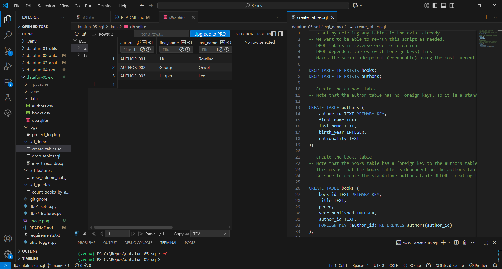

# datafun-05-sql

Creating a GitHub account and repository, and setting up a local project to sync with it, is a standard workflow for developers. Here's a step-by-step guide based on your request.

## 1\. GitHub Account and Repository

  * **Create a GitHub Account:** Go to [github.com](https://github.com) and sign up with your email. Follow the on-screen instructions to create your account.
  * **Create a New Repository:** On your GitHub home page, click the **New** button to create a new repository. Name it **`datafun-01-utils`**. You can add an optional description and choose to make it public or private.
  * **Initialize with a README:** It's a good practice to check the "Add a README file" box. This creates an initial file in your repository, which makes cloning easier.

-----

## 2\. Local Setup and Cloning

  * **Create Your Project Folder:** On your computer, open a file explorer and navigate to your `C:` drive. Create a new folder named `Repos`. The full path will be `C:\Repos`.
  * **Clone the Repository:**
      * Open Visual Studio Code.
      * Go to **Terminal** \> **New Terminal** in the top menu.
      * In the terminal, navigate to your new folder by typing `cd C:\Repos`.
      * Now, clone your repository. **Replace** `youraccount` and `yourrepo` with your actual GitHub username and repository name.
        ```
        git clone https://github.com/youraccount/datafun-01-utils.git
        ```
      * After this command, a new folder named **`datafun-01-utils`** will appear inside your `C:\Repos` folder.

-----

## 3\. Adding and Syncing Files

  * **Add `.gitignore` and `requirements.txt`:**
      * In the VS Code file explorer, open the newly created `datafun-01-utils` folder.
      * Create a new file named **`.gitignore`** (make sure there's a dot at the beginning). This file tells Git to ignore certain files and folders, like your virtual environment.
      * Create another new file named **`requirements.txt`**. This file will list all the Python packages your project depends on.
  * **Sync and Save Changes:** In the VS Code terminal, make sure you are in the `datafun-01-utils` folder (`cd C:\Repos\datafun-01-utils`). Then run the following commands in order:
    ```
    git add .
    git commit -m "Add .gitignore and requirements.txt files"
    git push -u origin main
    ```
      * The `git add .` command stages all your changes.
      * The `git commit` command saves a snapshot of your changes with a descriptive message.
      * The `git push` command uploads your changes from your local repository to the remote one on GitHub.

-----

## 4\. Create a Virtual Environment

  * With your terminal still open and your current directory set to `C:\Repos\datafun-01-utils`, run the following command to create a virtual environment:
    ```
    py -m venv .venv
    ```
  * This command creates a new folder named **`.venv`** in your project directory. This folder contains a local, isolated Python environment where you can install packages for this specific project without affecting your system's global Python installation.

## 5\. Working with SQLite (Python Script)
The following Python script, which you can save as db01_setup.py, handles connecting to the database, executing your SQL setup files in the correct order, and logging the process.

Note: This script assumes you have a utils_logger.py file defining a logger object.

import sqlite3
import os
import pathlib

# Import local modules
# NOTE: Ensure utils_logger.py correctly defines and exports 'logger'
from utils_logger import logger 


def execute_sql_file(connection: sqlite3.Connection, file_path: pathlib.Path) -> None:
    """
    Executes a SQL file using the provided SQLite connection.

    Args:
        connection (sqlite3.Connection): SQLite connection object.
        file_path (pathlib.Path): Path to the SQL file to be executed.
    """
    # We know reading from a file can raise exceptions, so we wrap it in a try block
    try:
        with open(file_path, 'r') as file:
            # Read the SQL file into a string
            sql_script: str = file.read()
            
        with connection:
            # Use the connection as a context manager to execute the SQL script
            connection.executescript(sql_script)
            logger.info(f"Executed: {file_path.name}")
            
    except Exception as e:
        logger.error(f"Failed to execute {file_path.name}: {e}")
        # Re-raise the exception to stop the script if a critical setup step fails
        raise

def main() -> None:
    """
    Main function to orchestrate the database setup process.
    """
    # Log start of database setup
    logger.info("Starting database setup...")

    # Define path variables
    ROOT_DIR = pathlib.Path(__file__).parent.resolve()
    # SQL files must be placed in a subdirectory called 'sql_create'
    SQL_CREATE_FOLDER = ROOT_DIR.joinpath("sql_create")
    # Database file will be stored in a subdirectory called 'data'
    DATA_FOLDER = ROOT_DIR.joinpath("data")
    DB_PATH = DATA_FOLDER.joinpath('db.sqlite')

    # Ensure the data folder where we will put the db exists
    DATA_FOLDER.mkdir(exist_ok=True)
    
    connection = None # Initialize outside try/except for use in finally
    
    # Connect to SQLite database (it will be created if it doesn't exist)
    try:
        connection = sqlite3.connect(DB_PATH)
        logger.info(f"Connected to database: {DB_PATH}")

        # Execute SQL files to set up the database
        # Order is critical: 01_drop_tables, 02_create_tables, 03_insert_records
        execute_sql_file(connection, SQL_CREATE_FOLDER.joinpath('01_drop_tables.sql'))
        execute_sql_file(connection, SQL_CREATE_FOLDER.joinpath('02_create_tables.sql'))
        execute_sql_file(connection, SQL_CREATE_FOLDER.joinpath('03_insert_records.sql'))

        logger.info("Database setup completed successfully.")
        
    except Exception as e:
        logger.error(f"Critical error during database setup: {e}")
        
    finally:
        if connection:
            connection.close()
            logger.info("Database connection closed.")


if __name__ == '__main__':
    main()
## 6\..SQL: Create Tables (02_create_tables.sql)
This script must be executed after dropping old tables. Note that the child table (books) must reference the parent table (authors).
-- Create the authors table (Parent Table)
CREATE TABLE authors (
    author_id TEXT PRIMARY KEY,    -- Prefixed sequential ID as the primary key (e.g., AUTHOR_001)
    name TEXT NOT NULL,            -- Author's name (mandatory field)
    birth_year INTEGER,            -- Year of birth (optional)
    nationality TEXT               -- Nationality of the author (optional)
);

-- Create the books table (Child Table)
CREATE TABLE books (
    book_id TEXT PRIMARY KEY,      -- Prefixed sequential ID as the primary key (e.g., BOOK_001)
    title TEXT NOT NULL,           -- Book title (mandatory field)
    genre TEXT,                    -- Book genre (optional)
    publication_year INTEGER,      -- Year of publication (optional)
    author_id TEXT,                -- Foreign key linking to authors
    FOREIGN KEY (author_id) 
        REFERENCES authors (author_id) -- Defines the relationship with authors
);

## 7\. SQL: Insert Values (03_insert_records.sql)
This script populates the tables. The authors (parent) records must be inserted before the books (child) records. Note the use of '' to escape the single quote in "Sorcerer's Stone".
-- Insert records into the authors table first (Parent)
INSERT INTO authors (author_id, name, birth_year, nationality) VALUES
('AUTHOR_001', 'J.K. Rowling', 1965, 'British'),
('AUTHOR_002', 'George Orwell', 1903, 'British'),
('AUTHOR_003', 'Harper Lee', 1926, 'American');

-- Insert records into the books table (Child)
-- IMPORTANT: Use two single quotes ('' ) to escape a single quote within a string.
INSERT INTO books (book_id, title, genre, publication_year, author_id) VALUES
('BOOK_001', 'Harry Potter and the Sorcerer''s Stone', 'Fantasy', 1997, 'AUTHOR_001'),
('BOOK_002', 'Harry Potter and the Chamber of Secrets', 'Fantasy', 1998, 'AUTHOR_001'),
('BOOK_003', '1984', 'Dystopian', 1949, 'AUTHOR_002'),
('BOOK_004', 'Animal Farm', 'Political Satire', 1945, 'AUTHOR_002'),
('BOOK_005', 'To Kill a Mockingbird', 'Fiction', 1960, 'AUTHOR_003');
## 8\. SQL: Drop Tables (01_drop_tables.sql)
This script ensures a clean slate by deleting existing tables. The child table (books) must be dropped before the parent table (authors) to satisfy foreign key constraints.
-- Drop the books table if it exists
DROP TABLE IF EXISTS books;

-- Drop the authors table if it exists
DROP TABLE IF EXISTS authors;

## 9\. SQL: Use COUNT (Sample Query)
This is a sample query you can run after setup to verify the data and practice using COUNT() with GROUP BY and JOIN.
-- Query to count the number of books written by each author
SELECT 
    a.name AS author_name, 
    COUNT(b.book_id) AS book_count 
FROM 
    authors a 
LEFT JOIN 
    books b ON a.author_id = b.author_id 
GROUP BY 
    a.name 
ORDER BY 
    book_count DESC;
